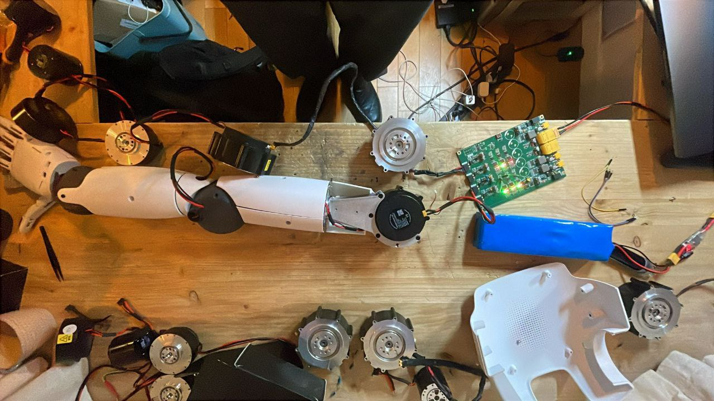
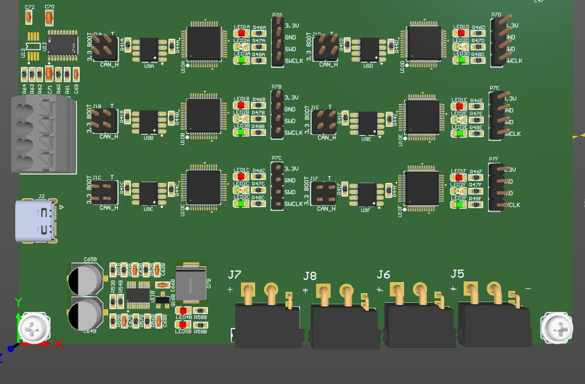
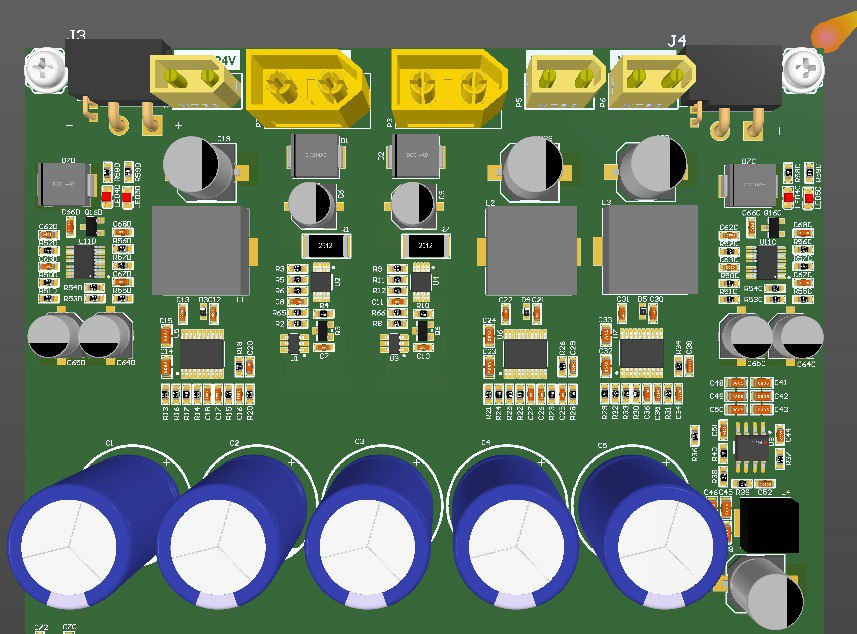
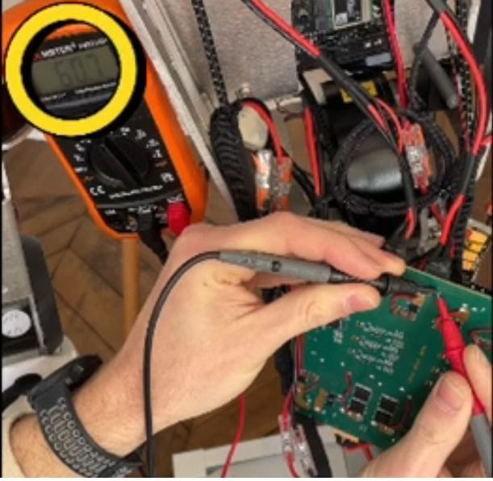
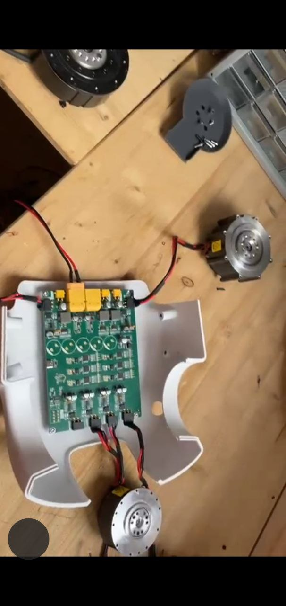
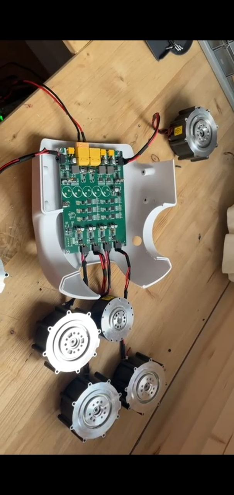
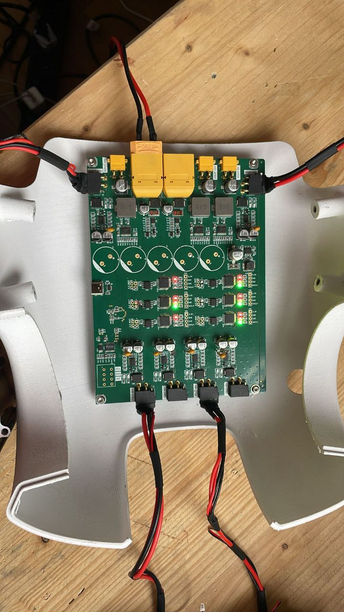
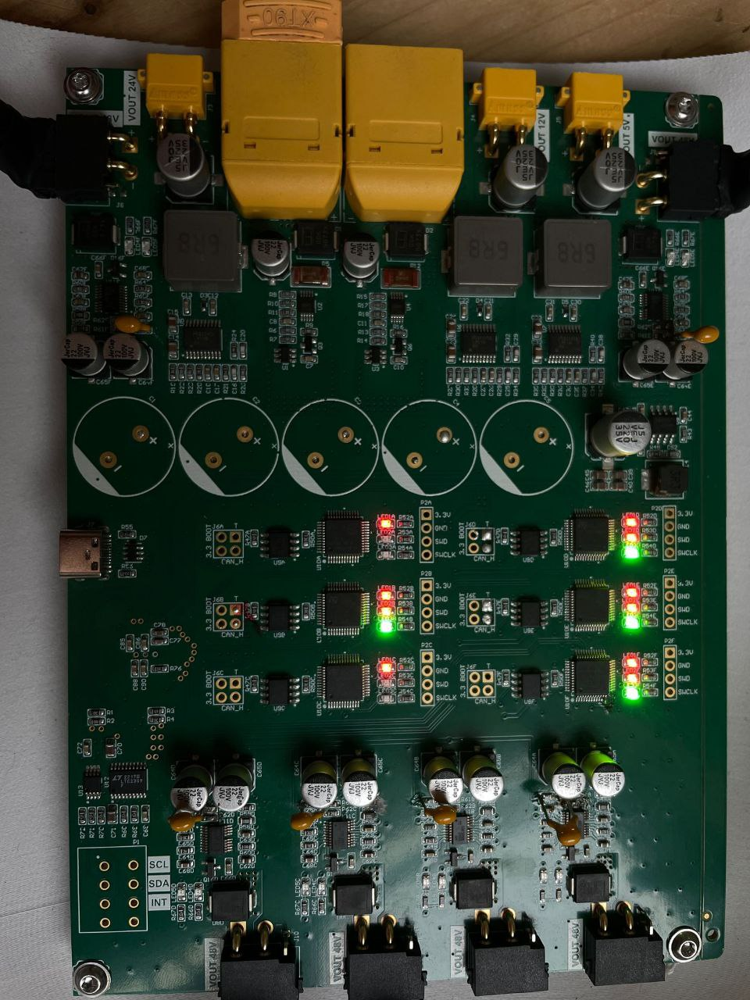

# Humanoid Robot CAN & Power Controller



Custom electronics platform developed by **GEC Engineering** for a humanoid robotic system. The project combines multi-channel CAN/CAN-FD communication, USB-C integration with a central Linux computer, 48 V power distribution, regulated auxiliary power rails, hardware protection, remote debugging, and validation on real robot hardware.

**Lead Engineer: Oleg Gridin, BEng**

## Hardware Demonstration Videos

### Video 1 — Hardware Integration

Five motors connected to the custom electronics during humanoid robot system integration.

https://github.com/user-attachments/assets/e82cf95d-304d-462a-9d68-b101e2b2865c

### Video 2 — Functional Motor Test

Functional motor rotation test demonstrating operation of the developed electronics after hardware debugging and modification.

https://github.com/user-attachments/assets/072d7310-e635-4128-970f-823c1a19b04a

---

## Project Overview

The client required a compact integrated electronics solution for a mobile humanoid robot powered from a 48 V battery and controlled by an NVIDIA Jetson Orin Nano. The robot architecture includes multiple motorized limbs, RobStride actuators, servo-driven joints, auxiliary mechanisms and end-effectors.

The development focused on two main subsystems:

1. **Multi-channel CAN / CAN-FD communication system**
2. **48 V Power Distribution Board (PDB)**

The communication subsystem provides several independent CAN/CAN-FD channels and connects them to the central Linux computer through USB-C. The power subsystem accepts the main 48 V battery supply, distributes high-current power to the robot limbs, and generates regulated auxiliary rails for logic, sensors and other onboard electronics.

The electronics were manufactured and assembled by the client, integrated into the physical robot hardware, remotely debugged together with GEC Engineering, modified after initial hardware tests, and brought to the intended functional state.

---

## Main Requirements

- 48 V main battery system
- NVIDIA Jetson Orin Nano central computer
- multiple motorized limbs and RobStride motors
- CAN / CAN-FD communication
- up to 6 independent CAN channels
- USB-C connection to the central computer
- Linux SocketCAN compatibility
- 48 V high-current power distribution
- regulated 24 V, 12 V and 5 V rails
- individual protection of power outputs
- compact integration inside the robot body

---

## System Architecture

### Communication Layer

```text
Robot Limb / Actuator Bus #1 --+
Robot Limb / Actuator Bus #2 --+
Robot Limb / Actuator Bus #3 --+
Robot Limb / Actuator Bus #4 --+--> Custom Multi-CAN Board --> USB-C --> Jetson Orin Nano
CAN Bus #5 (reserve) -----------+
CAN Bus #6 (reserve) -----------+
```

### Power Layer

```text
48 V Battery
     |
     v
Custom Power Distribution Board
     |
     +--> 48 V Limb Power Bus #1
     +--> 48 V Limb Power Bus #2
     +--> 48 V Limb Power Bus #3
     +--> 48 V Limb Power Bus #4
     +--> Reserve Power Output #1
     +--> Reserve Power Output #2
     |
     +--> Regulated 24 V
     +--> Regulated 12 V
     +--> Regulated 5 V
```

---

## Multi-CAN / USB-C Communication System

The communication section was developed to replace multiple separate USB-CAN adapters with a compact integrated solution. It provides independent CAN/CAN-FD channels, simultaneous communication, USB-C connection to the central Linux computer, SocketCAN compatibility, CAN transceivers, CAN-line protection, termination support and onboard status indication.



The open-source candleLight firmware ecosystem was used as a compatibility reference for the USB-CAN architecture.

https://github.com/candle-usb/candleLight_fw

---

## 48 V Power Distribution System

The high-power section receives the main robot battery supply and distributes it between the robot limbs and auxiliary systems.

- nominal input: **48 V DC**
- operating range: approximately **40–60 V DC**
- main outputs: Arm 1, Arm 2, Leg 1, Leg 2 and reserve outputs
- regulated auxiliary rails: **24 V, 12 V and 5 V**

The design considered individual output protection, transient protection, reverse-polarity protection, filtering, thermal management, high-current PCB routing and stable low-voltage supply for sensitive electronics.



---

## PCB Design, Manufacturing and Assembly Files

The repository includes a dedicated `Hardware/` directory for production data for the MotorDriver_CAN PCB.

```text
Hardware/
├── BOM/
│   ├── Bill of Materials-MotorDriver_CAN.xlsx
│   └── Bill of Materials-MotorDriver_CAN-JLCPCB Assembly Order.xls
├── Assembly/
│   ├── Pick Place for MotorDriver_CAN.csv
│   └── Pick Place for MotorDriver_CAN.txt
└── Fabrication/
    ├── Gerber/
    ├── NC Drill/
    └── Report Board Stack/
```

The manufacturing package contains the BOM, JLCPCB assembly BOM, component placement data, Gerber/CAM outputs, NC Drill files and board-stack report required to reproduce the PCB manufacturing data.

---

## Remote Hardware Debugging

After the first hardware assembly, GEC Engineering worked remotely with the client to perform system bring-up and debugging. The client performed measurements directly on the physical PCB according to our instructions. The process included voltage measurements, checking power rails and PCB nodes, communication verification and analysis of real hardware behavior.




---

## Hardware Modification After Initial Testing

During initial real-hardware testing, a PCB modification was identified as necessary. GEC Engineering prepared the modification procedure and the client performed the correction directly on the manufactured PCB.


After the modification, the board was tested again and the communication and power sections were verified.

---

## Robot Integration

The board was installed into the physical robotic assembly with the actual motors, power wiring and communication wiring connected.





---

## Final Functional Validation

Final tests show the powered custom PCB, active status LEDs, multiple communication channels, connected motor wiring and operating power distribution in the real robot hardware.





The engineering cycle was:

```text
Client Requirements
        ↓
System Architecture
        ↓
Electrical Design
        ↓
PCB Design
        ↓
Manufacturing & Assembly
        ↓
Remote Debugging
        ↓
PCB Modification
        ↓
Robot Integration
        ↓
Final Functional Validation
```

---

## Main Engineering Work Performed by GEC Engineering

- humanoid robot electronics architecture analysis
- actuator load and power-budget analysis
- CAN / CAN-FD communication architecture
- USB-CAN integration and SocketCAN compatibility planning
- custom schematic and PCB design
- 48 V power-distribution design
- regulated 24/12/5 V power rails
- connector and interface planning
- component selection and protection circuitry
- manufacturing preparation: Gerber, NC Drill, BOM and Pick & Place
- hardware bring-up and remote debugging
- hardware modification instructions
- robot integration and validation support

**Lead Engineer: Oleg Gridin, BEng**

---

## Repository Structure

```text
.
├── README.md
├── images/                 # Project photos and PCB renders
├── Hardware/               # PCB manufacturing and assembly package
│   ├── BOM/
│   ├── Assembly/
│   └── Fabrication/
│       ├── Gerber/
│       ├── NC Drill/
│       └── Report Board Stack/
├── video1.mp4
└── video2.mp4
```

---

## Related BMS Development

GEC Engineering has also developed dedicated battery-management monitoring and diagnostic systems for high-power robotic platforms, including multi-BMS monitoring, RS-485 communication, diagnostics and battery-system integration.

https://github.com/gridinwork/JK-BMS-PB2A16S-20P

---

# Русское описание

## Контроллер CAN и питания для гуманоидного робота

Компания **GEC Engineering** разработала специализированную электронную систему для мобильного гуманоидного робота по техническому заданию клиента. Центральным вычислителем является NVIDIA Jetson Orin Nano. Электроника обеспечивает несколько независимых CAN/CAN-FD каналов, USB-C интеграцию, распределение основного питания 48 В и формирование вспомогательных линий 24 В, 12 В и 5 В.

Проект прошёл полный инженерный цикл: анализ требований, архитектура, схемотехника, PCB layout, подготовка производственных файлов, изготовление и сборка клиентом, удалённая аппаратная отладка, модификация PCB, интеграция в робота и финальная функциональная проверка.

### Производственные файлы

В каталоге `Hardware/` организован производственный комплект MotorDriver_CAN:

- `Hardware/BOM/` — BOM и вариант BOM для сборки JLCPCB;
- `Hardware/Assembly/` — Pick & Place / координаты компонентов;
- `Hardware/Fabrication/Gerber/` — Gerber/CAM данные;
- `Hardware/Fabrication/NC Drill/` — файлы сверления;
- `Hardware/Fabrication/Report Board Stack/` — отчёт по структуре платы.

Все изображения проекта перенесены в каталог `images/`, а ссылки в этом README используют новую структуру.

### Работы GEC Engineering

GEC Engineering выполнила анализ архитектуры робота, расчёт силовой нагрузки, разработку CAN/CAN-FD и USB-CAN архитектуры, интеграцию SocketCAN, схемотехнику, PCB layout, проектирование силовой части и DC/DC питания 24/12/5 В, защиту силовых и сигнальных линий, подбор компонентов, подготовку производственного комплекта, техническую поддержку при сборке, удалённую отладку и поддержку финальной проверки оборудования.

**Главный инженер проекта — Oleg Gridin, BEng.**

---

## Developer

**GEC Engineering**  
**Lead Engineer — Oleg Gridin, BEng**

Website: https://gec-engineering.tech/  
YouTube: https://www.youtube.com/@GEC_Company  
GitHub: https://github.com/gridinwork
