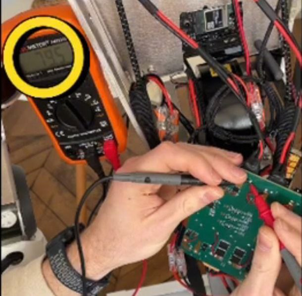
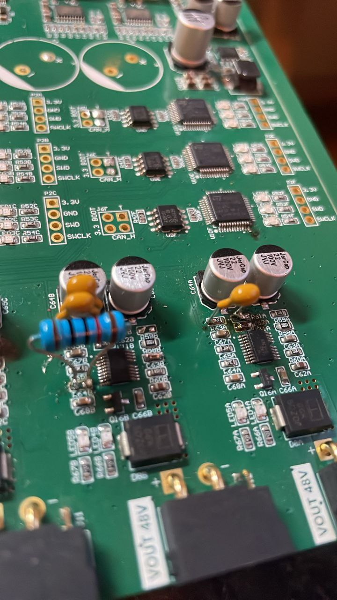
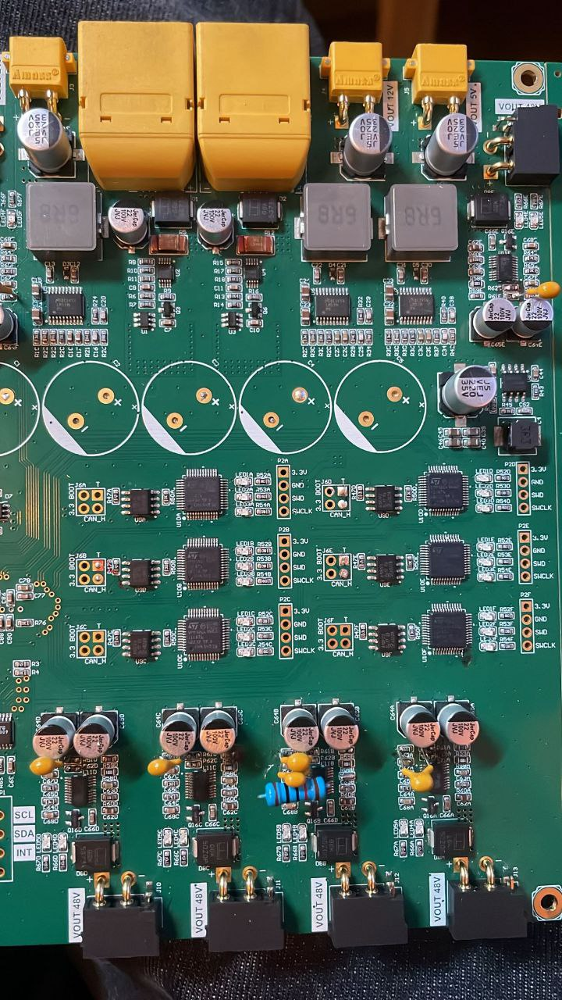

# Humanoid Robot CAN & Power Controller


## Hardware Demonstration Videos

### Video 1 — Hardware Integration

**Five motors connected to the custom electronics during humanoid robot system integration.**

[▶ Watch video1.mp4 — Five motors connected](video1.mp4)

### Video 2 — Functional Motor Test

**Functional motor rotation test demonstrating operation of the developed electronics after hardware debugging and modification.**

[▶ Watch video2.mp4 — Motor rotation test](video2.mp4)

Custom electronics platform developed for a humanoid robotic system: multi-channel CAN/CAN-FD communication, USB-C integration with a central Linux computer, 48 V power distribution, regulated auxiliary power rails, hardware protection, remote debugging, and validation on real robot hardware.

This project was developed by **GEC Engineering**.  
**Lead Engineer: Oleg Gridin, BEng**

---

## Project Overview

The client required a compact, integrated electronics solution for a mobile humanoid robot powered from a 48 V battery and controlled by an NVIDIA Jetson Orin Nano.

The robot architecture includes multiple motorized limbs, RobStride actuators, servo-driven joints, auxiliary mechanisms and end-effectors. Instead of using multiple independent communication adapters and separate power modules, the goal was to consolidate communication and power-distribution functions into dedicated custom electronics.

The development focused on two main subsystems:

1. **Multi-channel CAN / CAN-FD communication system**
2. **48 V Power Distribution Board (PDB)**

The communication subsystem provides several independent CAN/CAN-FD channels and connects them to the robot's central Linux computer through USB-C. The power subsystem accepts the main 48 V battery supply, distributes high-current power to the robot limbs, and generates regulated auxiliary voltage rails for logic, sensors and other onboard electronics.

The resulting electronics were manufactured and assembled by the client, integrated into the physical robot hardware, remotely debugged together with GEC Engineering, modified after the first hardware tests, and successfully brought to full intended functionality.

---

## Client Requirements

The original technical requirements defined a humanoid mobile robot with:

- 48 V main battery system
- NVIDIA Jetson Orin Nano as the central computer
- multiple motorized limbs
- RobStride motors
- CAN / CAN-FD communication
- several independent communication channels
- USB-C connection to the central computer
- 48 V power distribution to the limbs
- regulated 24 V, 12 V and 5 V rails
- individual protection of power outputs
- compact integration inside the robot body
- compatibility with Linux SocketCAN
- hardware suitable for real robot operation and service

The communication architecture was intended to support up to **6 independent CAN channels** operating simultaneously. The power architecture was intended to support four main robot limbs, two reserve channels, separate protected high-current power paths and auxiliary regulated power for electronics and sensors.

---

## System Architecture

The robot uses an **NVIDIA Jetson Orin Nano** as the high-level controller. Its responsibilities include high-level robot control, actuator communication, Linux-based software, SocketCAN interface, sensor/peripheral integration and robot computation.

### Communication Layer

```text
Robot Limb / Actuator Bus #1 --+
Robot Limb / Actuator Bus #2 --+
Robot Limb / Actuator Bus #3 --+
Robot Limb / Actuator Bus #4 --+--> Custom Multi-CAN Board --> USB-C --> Jetson Orin Nano
CAN Bus #5 (reserve) -----------+
CAN Bus #6 (reserve) -----------+
```

### Power Layer

```text
48 V Battery
     |
     v
Custom Power Distribution Board
     |
     +--> 48 V Limb Power Bus #1
     +--> 48 V Limb Power Bus #2
     +--> 48 V Limb Power Bus #3
     +--> 48 V Limb Power Bus #4
     +--> Reserve Power Output #1
     +--> Reserve Power Output #2
     |
     +--> Regulated 24 V
     +--> Regulated 12 V
     +--> Regulated 5 V
```

---

## Board 1 — Multi-CAN / USB-C Communication System

The communication section was developed to replace multiple separate USB-CAN adapters with a compact integrated solution. It provides up to six independent CAN/CAN-FD channels, simultaneous communication, USB-C connection to the central Linux computer, SocketCAN compatibility, independent CAN transceivers, CAN-line protection, termination support and onboard status indication.

The requirements included Classical CAN 2.0B, CAN FD/FDCAN, arbitration rates up to approximately 1 Mbit/s and higher CAN-FD data rates where required by connected devices.


### candleLight / SocketCAN Architecture

For the USB-CAN communication architecture, the open-source **candleLight firmware ecosystem** was used as an important compatibility reference:

https://github.com/candle-usb/candleLight_fw

The goal was not to install a collection of external adapters inside the robot, but to integrate the required USB-CAN functionality into the custom electronics architecture around Linux SocketCAN and the Jetson Orin Nano.

---

## Board 2 — 48 V Power Distribution System

The high-power section receives the main robot battery supply and distributes it between the robot's limbs and auxiliary systems.

- nominal input: **48 V DC**
- operating range: approximately **40–60 V DC**
- main outputs: Arm 1, Arm 2, Leg 1, Leg 2 and reserve outputs
- regulated auxiliary rails: **24 V, 12 V and 5 V**

The design considered individual output protection, transient protection, reverse-polarity protection, filtering, thermal management, high-current PCB routing and stable low-voltage supply for sensitive electronics.


---

## Robot Load Analysis

Before the PCB design was finalized, the expected actuator loads were analyzed. The design documentation considered multiple RobStride motors per limb, additional motor loads, simultaneous and peak-current conditions, voltage-drop risks, current limiting and distribution of power between independent buses.

This analysis influenced connector selection, copper and power-path design, protection components, DC/DC converter selection, thermal design and power-bus separation.

---

## PCB Design and Manufacturing

The PCB was designed as a custom robot-specific electronics platform rather than as a generic development board. The work included system architecture, schematic design, PCB layout, power-path and communication routing, connector positioning, component selection, protection circuitry, regulated power sections, CAN interfaces, USB interface, status indication and manufacturing preparation.

The PCB was modeled and reviewed in 3D before manufacturing to verify connector positions, component clearances, board proportions, large power components, wiring access and mechanical integration.

After the design was completed, the client manufactured and assembled the physical hardware and connected it to the robot power system, motors, communication lines and test equipment.

---

## Remote Hardware Debugging

After the first hardware assembly, **GEC Engineering worked remotely with the client** to perform system bring-up and debugging. The client performed measurements directly on the physical PCB according to our instructions.

The debugging process included voltage measurements, checking power rails and PCB nodes, communication verification, analysis of hardware behavior and comparison of real measurements with the design.




---

## Hardware Modification After Initial Testing

During the first real-hardware debugging stage, a small PCB modification was identified as necessary. GEC Engineering prepared the modification procedure, and the client performed the hardware correction directly on the manufactured PCB according to our instructions.





After this modification the board was tested again, the communication and power sections were verified, and the system reached the intended functional state. This stage demonstrates practical hardware bring-up, fault analysis and engineering support after manufacturing—not only schematic and PCB design.

---

## Robot Integration

After debugging, the board was installed into the physical robotic assembly with the actual motors, power wiring and communication wiring connected.


This confirms that the project progressed beyond PCB design and was integrated into a real electromechanical humanoid robot system.

---

## Final Functional Validation

After the PCB modification and repeated testing, the system achieved full intended functionality. The final tests show the powered custom PCB, active status LEDs, multiple communication channels, connected motor wiring and operating power distribution in the real robot hardware.


The complete engineering cycle was:

```text
Client Requirements
        ↓
System Architecture
        ↓
Electrical Design
        ↓
PCB Design
        ↓
Manufacturing & Assembly
        ↓
Remote Debugging
        ↓
PCB Modification
        ↓
Robot Integration
        ↓
Final Functional Validation
```

---

## Main Engineering Work Performed by GEC Engineering

GEC Engineering was responsible for the electronics-development work based on the client's technical requirements, including:

- analysis of the humanoid robot architecture
- power-budget and actuator-load analysis
- CAN / CAN-FD communication architecture
- USB-CAN integration concept
- SocketCAN compatibility planning
- custom PCB architecture
- schematic design and PCB layout
- power-distribution design
- regulated 24/12/5 V power-rail design
- connector and interface planning
- component selection and protection circuitry
- manufacturing preparation
- hardware bring-up support
- remote debugging
- hardware modification instructions
- system validation support

**Lead Engineer: Oleg Gridin, BEng**

---

## Related BMS Development

GEC Engineering has also developed dedicated battery-management monitoring and diagnostic systems for high-power robotic platforms, including multi-BMS monitoring, RS-485 communication, diagnostics and battery-system integration.

Detailed BMS development:

https://github.com/gridinwork/JK-BMS-PB2A16S-20P

---

## Project Files and Media

This repository contains available engineering materials related to the development, including hardware photographs, debugging photographs, robot-integration photographs and hardware demonstration videos. Additional test firmware, schematics, PCB/manufacturing files and technical documentation may be added where permitted. Some materials may be omitted or simplified where required by client confidentiality.

---

# Русское описание

## Электроника гуманоидного робота — Multi-CAN управление и распределение питания

Компания **GEC Engineering** разработала специализированную электронную систему для мобильного гуманоидного робота по техническому заданию клиента.

**Главный инженер проекта — Oleg Gridin, BEng.**

### Видео испытаний

**Видео 1 — Интеграция оборудования:** клиент демонстрирует собранную роботизированную систему с пятью моторами, подключёнными к разработанной электронике.

[▶ Смотреть video1.mp4 — подключены пять моторов](video1.mp4)

**Видео 2 — Функциональный тест двигателя:** демонстрация вращения подключённого мотора после аппаратной отладки и модификации PCB.

[▶ Смотреть video2.mp4 — тест вращения двигателя](video2.mp4)

Основной задачей было создать компактную интегрированную электронику, которая одновременно обеспечивает связь центрального компьютера робота с несколькими независимыми CAN/CAN-FD шинами и распределяет основное питание 48 В между приводами, формируя дополнительные стабилизированные напряжения для бортовой электроники.

Центральным вычислителем системы является **NVIDIA Jetson Orin Nano**. В составе робота используются моторизированные руки и ноги, приводы RobStride, дополнительные исполнительные механизмы, CAN/CAN-FD, основное питание 48 В и вспомогательные линии 24 В, 12 В и 5 В.

### Multi-CAN / USB-C

Коммуникационная часть рассчитана на одновременную работу до шести независимых CAN/CAN-FD каналов и подключение к Jetson Orin Nano через USB-C. Предусмотрены отдельные CAN-трансиверы, защита линий, терминаторы, индикация и совместимость с Linux SocketCAN.

При разработке USB-CAN части архитектура open-source проекта **candleLight** использовалась как референс совместимости:

https://github.com/candle-usb/candleLight_fw

### Силовая часть 48 В

Плата принимает основное питание 48 В (ориентировочный рабочий диапазон 40–60 В), распределяет его по независимым силовым каналам приводов и формирует стабилизированные линии **24 В, 12 В и 5 В**. При проектировании учитывались рабочие и пиковые токи, одновременная работа приводов, просадки напряжения, защита отдельных линий, тепловые режимы, выбор разъёмов и силовая разводка PCB.

### Разработка и проверка PCB

Проект включал анализ технического задания, разработку архитектуры, схемотехнику, PCB layout, силовую разводку, CAN-интерфейсы, USB-интерфейс, DC/DC преобразователи, защиту, подбор компонентов, расположение разъёмов и подготовку к производству. Перед изготовлением плата была проверена в 3D.

После завершения проектирования клиент изготовил и собрал реальную печатную плату.

### Удалённая отладка и модификация

После сборки GEC Engineering совместно с клиентом выполнила удалённую аппаратную отладку. Клиент по нашим инструкциям проводил измерения непосредственно на плате. Проверялись напряжения, силовые линии, отдельные узлы PCB, коммуникационные каналы и фактическое поведение оборудования.

В процессе первых испытаний была определена необходимость небольшой модификации изготовленной платы. GEC Engineering подготовила инструкции, а клиент выполнил модификацию по нашим указаниям. После этого система была повторно проверена и достигла полного запланированного функционала.

### Интеграция в робота

После отладки плата была установлена в реальную роботизированную систему с подключенными двигателями, силовой и коммуникационной проводкой. Финальные испытания подтвердили работу питания, LED-индикации, коммуникационных каналов и электроники в составе реального оборудования.

Таким образом, проект прошёл полный инженерный цикл: от анализа требований и разработки схемы/PCB до изготовления, удалённой аппаратной отладки, корректировки и финальной проверки в составе реального гуманоидного робота.

### Работы GEC Engineering

В рамках проекта GEC Engineering выполнила анализ архитектуры робота, расчёт силовой нагрузки, разработку CAN/CAN-FD и USB-CAN архитектуры, интеграцию SocketCAN, схемотехнику, PCB layout, проектирование силовой части и DC/DC питания 24/12/5 В, защиту силовых и сигнальных линий, подбор компонентов, подготовку к производству, техническую поддержку при сборке, удалённую отладку, разработку инструкции по модификации PCB и поддержку финальной проверки оборудования.

**Главный инженер проекта — Oleg Gridin, BEng.**

### Связанный проект BMS

GEC Engineering также разработала отдельные системы мониторинга и диагностики BMS для мощных роботизированных платформ.

Подробное описание BMS-разработки:

https://github.com/gridinwork/JK-BMS-PB2A16S-20P

---

## Developer

**GEC Engineering**  
**Lead Engineer — Oleg Gridin, BEng**

Website: https://gec-engineering.tech/  
YouTube: https://www.youtube.com/@GEC_Company  
GitHub: https://github.com/gridinwork
